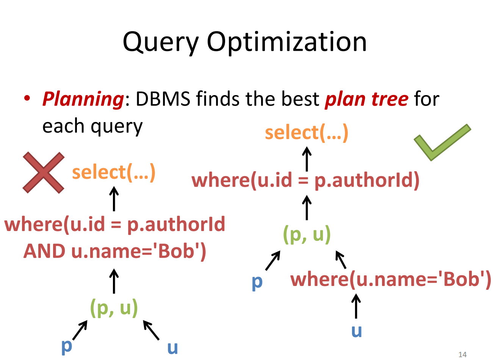
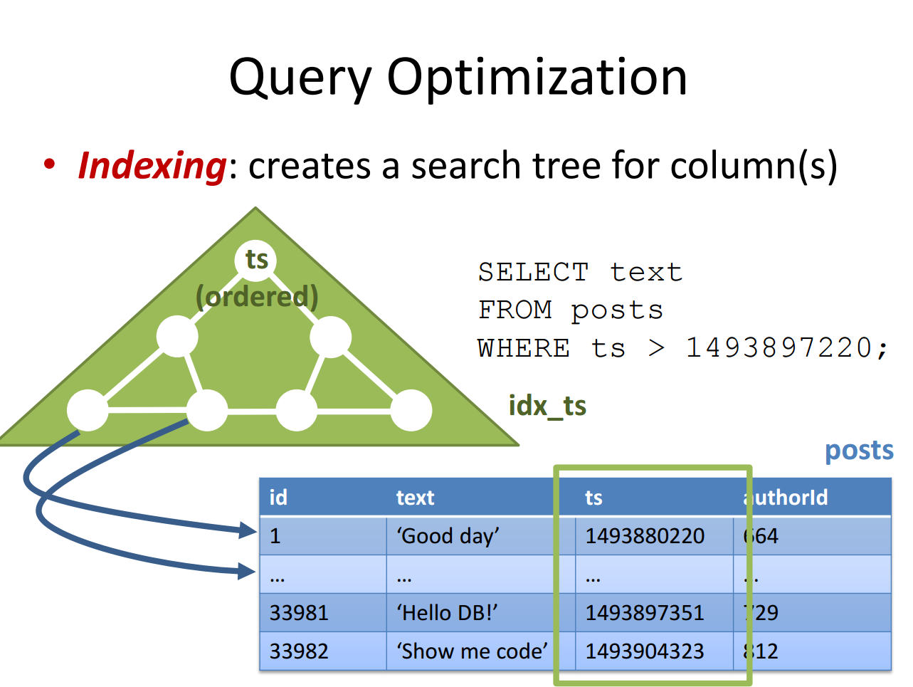
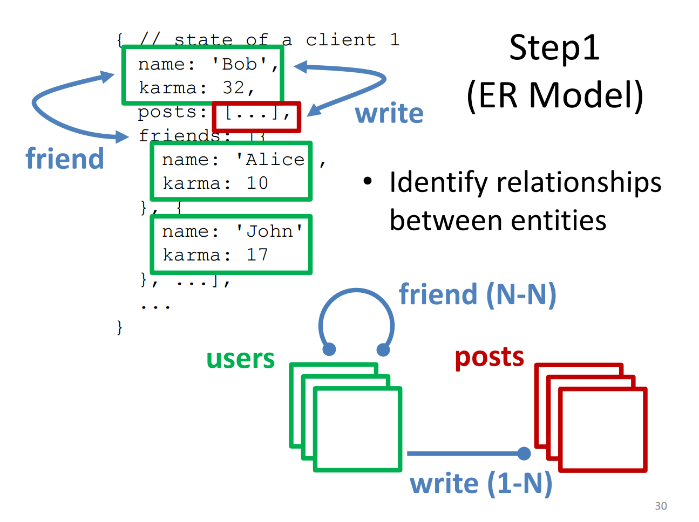
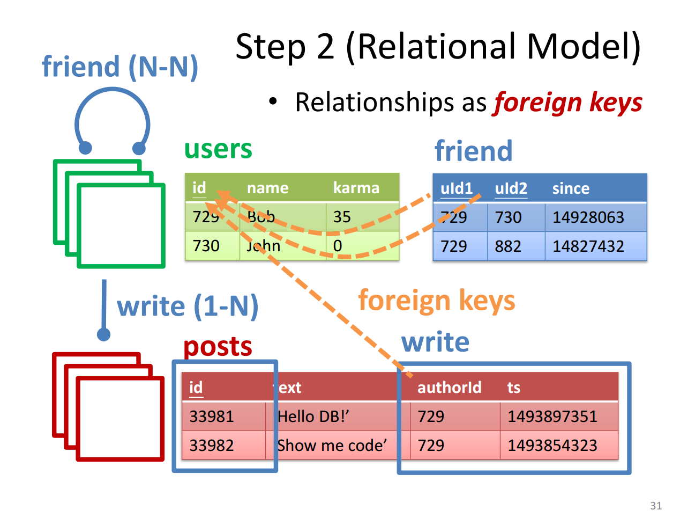
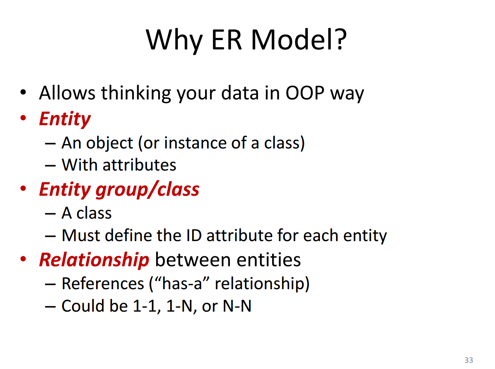
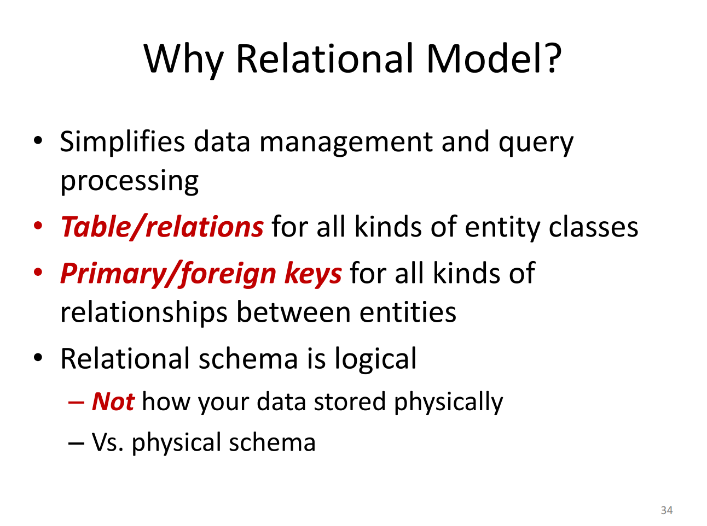

## 1. DBMS vs. Database
- **Database**: A collection of organized data stored on a computer.
- **DBMS**: Software that manages databases, facilitating efficient data storage, retrieval, and management.

## 2. Why Use a Database Instead of File Systems?
- **Speed**: DBMS can answer queries rapidly, ideal for tasks like finding posts by a specific author containing keywords.
- **Transactions**: Groups modifications, ensuring all actions succeed or fail as a whole (e.g., money transfer).
- **Crash Recovery**: Logs modifications to prevent data corruption post-recovery.

## 3. Key Advantages of Using DBMS
- Fast query processing, transaction management, and crash recovery.
- Supports complex queries with efficient data structuring.

## 4. Queries and Data Structuring
- **Step 1**: Organize data in tables with rows (records) and columns (fields).
- **Step 2**: Use SQL to query data. Example:
  ```sql
  SELECT p.id, p.text
  FROM posts AS p, users AS u
  WHERE u.id = p.authorId
    AND u.name='Bob'
    AND p.text ILIKE '%db%';

## 5. How DBMS Answers Queries Efficiently
- **Query Optimization**: DBMS plans the best path to execute each query.


- **Indexing**: Creates a search tree for columns to improve lookup speed.


## 6. Transactions and ACID Properties
- **Atomicity**: All or nothing execution.
- **Consistency**: Data remains correct after each transaction.
- **Isolation**: Transactions do not interfere with each other.
- **Durability**: Data remains safe after a transaction, even in case of crashes.

## 7. Data Models in DBMS
- **Why model data as tables?**: Using tables helps reduce redundancy and manage space complexity, addressing the conflict between the tree model often used on the client side and the relational model preferred on the server side.
- **Entity-Relationship (ER) Model**: Allows thinking of data in an object-oriented manner, establishing relationships (1-1, 1-N, N-N).
- **Relational Model**: Tables (relations) for entities, with primary keys for unique identification.





## 8. Example - Student Database Design
- **Entities**: Tables for students, departments, courses, enrollments, sections.
- **Relationships**: Use foreign keys to define relationships, with an intermediate table for many-to-many relationships.

## Terminology Recap
- **Columns** = fields = attributes
- **Rows** = records = tuples
- **Tables** = relations
- **Schema**: Defines the structure of a database, detailing table columns and data types.
