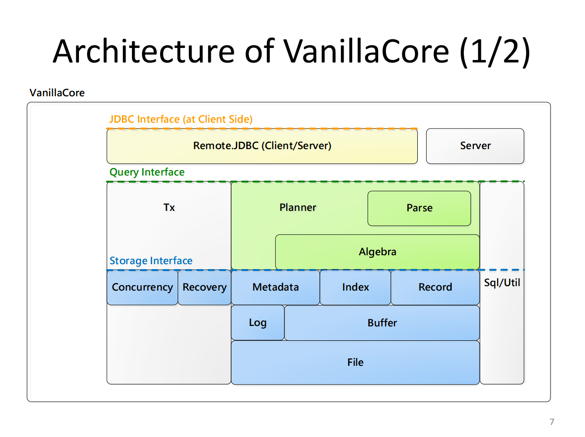
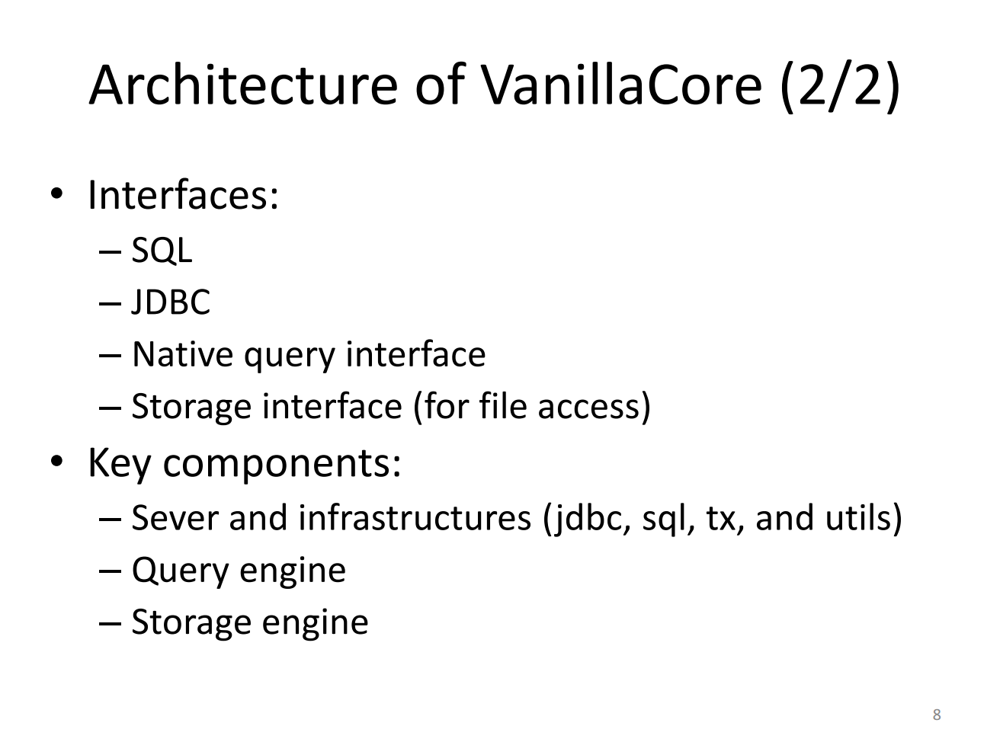
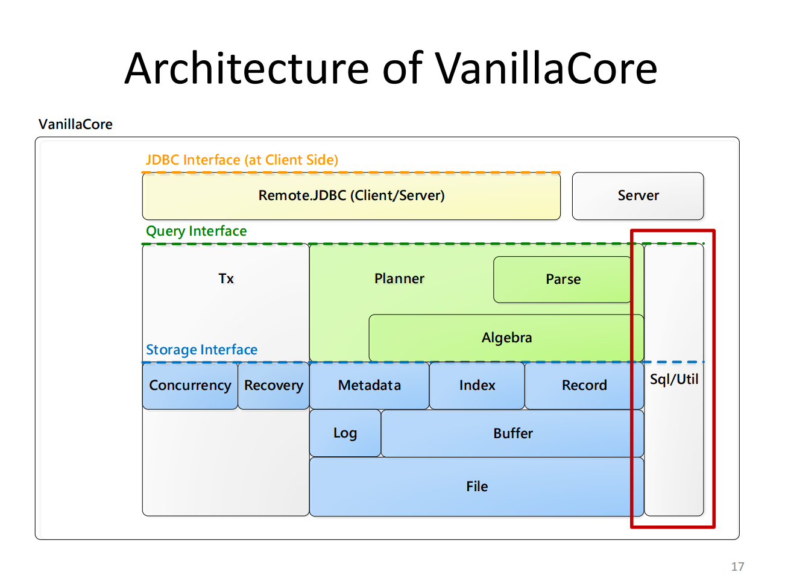

# 1. ER & Relational Models
- **RDBMS Definition**
  - A database management system that supports the relational model.
- **Architecture Origin**
  - Influenced by IBM System R (announced in 1974).
- **VanillaDB Project**
  - **VanillaCore**: A standalone RDBMS implemented in Java.
  - **VanillaBench**: Common benchmarking tools for RDBMS.
  - **VanillaComm**: Communication infrastructure for distributed RDBMS.


# 2. Reducing Redundancy & Inconsistency
- **Functional Architecture**
  - Query Engine.
  - Storage Engine.
  - Supported interfaces: SQL, JDBC, Native Query, and Storage Interface.
- **SQL Support**
  - Supports a subset of SQL-92, including basic DDL and DML operations.
  - Limitations include no support for JOIN, NULL values, or complex expressions.
- **Data Storage and Access**
  - Database: Directory.
  - Table: File.
  - Record: Bytes (accessed via pages).

# 3. Practical Applications
- **JDBC Usage Example**
  - **Connect to Database**:
    ```java
    Driver d = new JdbcDriver();
    Connection conn = d.connect("jdbc:vanilladb://localhost", null);
    ```
  - **Execute Query**:
    ```java
    Statement stmt = conn.createStatement();
    String qry = "SELECT s-name, d-name FROM departments, students WHERE major-id = d-id";
    ResultSet rs = stmt.executeQuery(qry);
    ```
  - **Output Results**:
    ```java
    while (rs.next()) {
        String sName = rs.getString("s-name");
        String dName = rs.getString("d-name");
        System.out.println(sName + "\t" + dName);
    }
    ```

# 4. Anomalies in Data
- **Types of Anomalies**:
  - **Insertion Anomaly**: Difficulty in adding data due to missing information.
  - **Update Anomaly**: Inconsistencies when data is not updated uniformly.
  - **Deletion Anomaly**: Loss of useful data when other data is deleted.

# 5. Normalization Process
- **Purpose**: Minimize duplication and inconsistency in data.
- **Forms Explained**:
  - **1st Normal Form**: Removes multi-valued attributes.
  - **2nd Normal Form**: Ensures all non-key attributes depend on the entire primary key.
  - **3rd Normal Form**: Ensures no transitive dependencies exist.
  - **BCNF**: Strengthens 3NF by ensuring all determinants are candidate keys.

# 6. Functional Dependencies and Normal Forms
- **Functional Dependency**: Relationship where one attribute uniquely determines another.
- **Challenges with Normalization**:
  - Reduces redundancy and increases integrity but can make queries more complex.

# 7. Query Processing and Metadata
- **Planner and Transaction**:
  - The planner determines efficient query execution plans.
  - Transactions ensure correctness and consistency.
- **Metadata**:
  - Describes database schema, views, indexes, and statistics for optimization.
  - Stored in catalog tables for querying like normal data.
