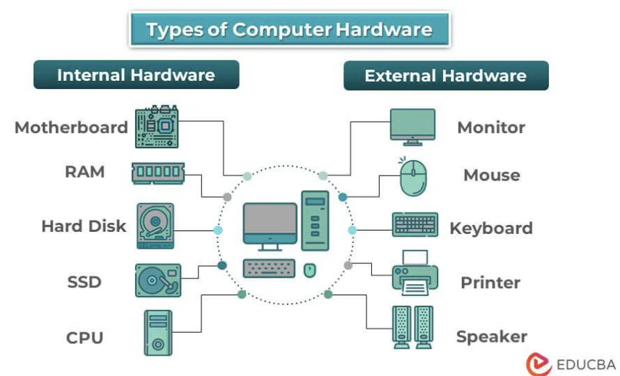
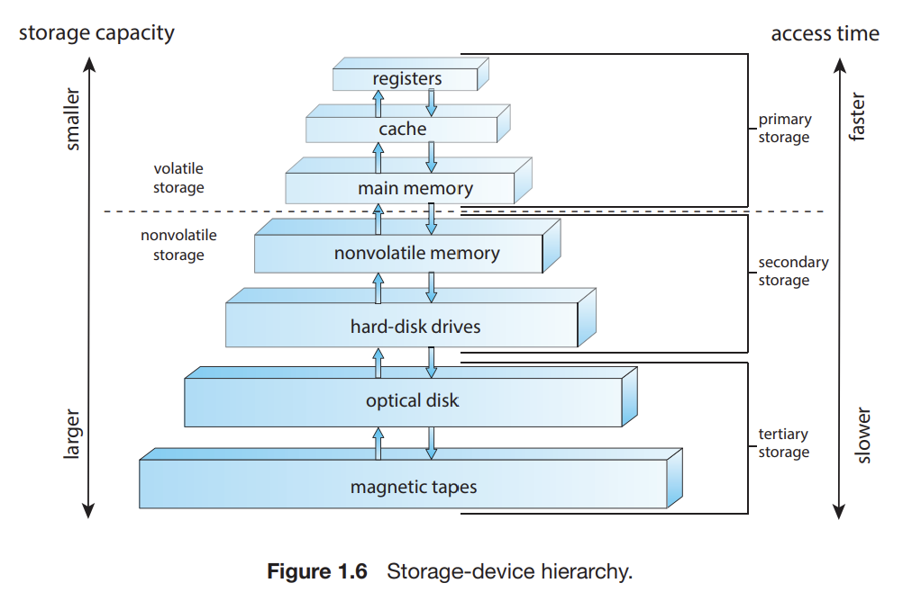
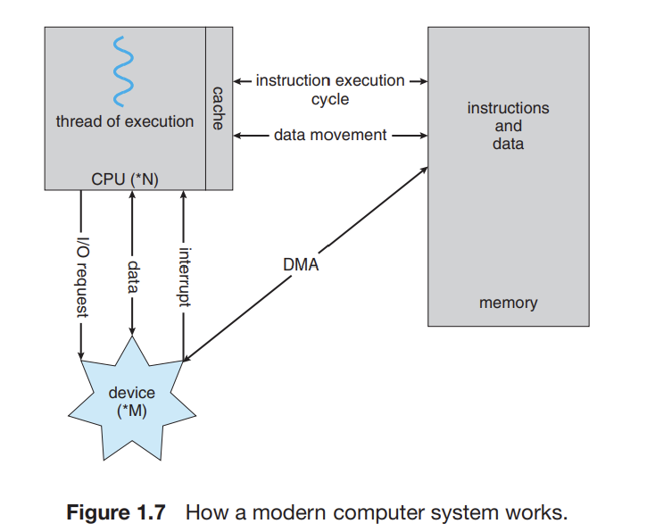

# 1. What Operating Systems Do
- **Operating System**: Software that manages computer hardware, provides a platform for application programs, and acts as an intermediary between users and hardware.
- **Purpose**: Facilitates program execution in a convenient and efficient manner, while ensuring system reliability and security.

# 2. Components of a Computer System
- **Hardware**: CPU, memory, and I/O devices, providing basic computing resources.
   
  

- **Operating System**: Manages hardware and coordinates its use among application programs and users.
- **Application Programs**: Software like web browsers and word processors, solving specific user problems.
- **User**: Interacts with the system via interfaces like GUIs or command lines.
   
  
   
  

# 3. Key Functions of Operating Systems
- **Resource Management**: Allocates CPU, memory, and I/O resources efficiently.
- **Process Management**: Handles process creation, scheduling, synchronization, and termination.
- **Memory Management**: Tracks memory allocation and optimizes usage.
- **File-System Management**: Manages data storage, organization, and retrieval.
- **Security and Protection**: Ensures data integrity, access control, and system safety.

# 4. Dual Modes of Operation
- **User Mode**: Executes user applications with restricted access to hardware resources.
- **Kernel Mode**: Executes core OS functions with full hardware access, ensuring controlled interactions.

# 5. Importance of Studying Operating Systems
- **Programming Foundation**: Understanding OS principles aids in writing efficient, secure, and reliable programs.
- **System Optimization**: Enables informed decisions when designing applications to leverage OS features effectively.
- **Modern Systems**: Insights into mobile, cloud, and distributed computing environments.

# 6. Examples of Operating Systems
- **Desktop OS**: Windows, macOS, Linux.
- **Mobile OS**: Android, iOS.
- **Embedded Systems**: Real-time operating systems in devices like cars and appliances.
- **Cloud Environments**: OS managing virtual machines and distributed resources.

