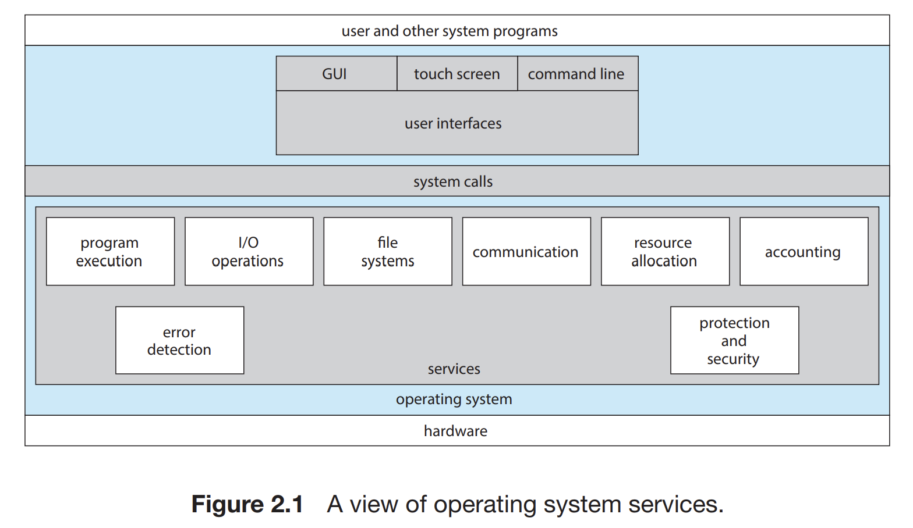

# 2. Operating-System Structures
## **2.1 Operating-System Services**
- **Purpose**: Provides essential functions that make the computing environment convenient and efficient for users and application programs.
- **Services Overview**:
  - **Program Execution**: Load and execute programs.
  - **I/O Operations**: Manages I/O operations and communication with hardware devices.
  - **File-System Manipulation**: Reads, writes, creates, and deletes files.
  - **Communication**: Supports communication between processes, whether on the same system or over a network.
  - **Error Detection**: Ensures proper detection and handling of errors.
  - **Resource Allocation**: Allocates CPU cycles, memory, and other resources among multiple users or jobs.
  - **Accounting and Monitoring**: Tracks resource usage for performance or billing purposes.
  - **Protection and Security**: Prevents unauthorized access and provides secure execution.
    

---

## **2.2 User and Operating-System Interface**
- **Command-Line Interface (CLI)**: Users interact via commands entered as text.
- **Graphical User Interface (GUI)**: Features windows, icons, menus, and pointers for intuitive interaction.
- **Touch-Screen Interfaces**: Direct manipulation via touch for mobile and touch-based devices.
- **Interface Choice**: The specific interface provided depends on user and system needs.

---

## **2.3 System Calls**
- **Definition**: Interfaces between programs and the operating system to request services.
- **Examples**:
  - File operations: `open()`, `read()`, `write()`, `close()`.
  - Device control: `ioctl()`.
  - Process control: `fork()`, `exit()`.
- **Application Programming Interface (API)**: Provides a higher-level abstraction of system calls.
- **Types**:
  - Process control
  - File management
  - Device management
  - Information maintenance
  - Communications

---

## **2.4 System Services**
- Utilities provided by the operating system for tasks like file management, disk management, and debugging.

---

## **2.5 Linkers and Loaders**
- **Linkers**: Combine object modules into a single executable file.
- **Loaders**: Load executables into memory for execution.

---

## **2.6 Why Applications Are Operating-System Specific**
- Different operating systems provide unique APIs and hardware requirements, necessitating system-specific application development.

---

## **2.7 Operating-System Design and Implementation**
- **Design Goals**:
  - **User Goals**: System should be convenient, reliable, and fast.
  - **System Goals**: Should be easy to design, implement, and maintain, as well as flexible and efficient.
- **Mechanisms vs. Policies**:
  - **Mechanisms**: Define how tasks are performed.
  - **Policies**: Define what tasks are performed.
- **Implementation**: Typically written in a combination of high-level languages (e.g., C) and assembly for hardware-dependent tasks.

---

## **2.8 Operating-System Structure**
- **Monolithic Structure**: All functionality in one kernel (e.g., Linux).
- **Layered Approach**: Divided into layers, each built on top of the previous one.
- **Microkernels**: Minimal kernel responsible for basic functions like communication and process management; other functions are implemented in user-space services.
- **Modules**: Uses modular design for flexibility and easy extensibility.
- **Hybrid Systems**: Combines multiple structures for efficiency and flexibility.

---

## **2.9 Building and Booting an Operating System**
- **Operating-System Generation**: Tailors the operating system to specific hardware or configurations.
- **System Boot**:
  - Firmware (e.g., BIOS or UEFI) initializes hardware and loads the boot loader.
  - The boot loader loads the operating system kernel into memory.

---

## **2.10 Operating-System Debugging**
- **Failure Analysis**: Identifies and corrects software defects.
- **Performance Monitoring and Tuning**: Evaluates and optimizes system performance.
- **Tracing**: Monitors system calls or instructions during execution.
- **BCC (BPF Compiler Collection)**: Tool for creating efficient debugging and monitoring utilities.

---

## **2.11 Summary**
- Operating systems provide essential services and interfaces for application programs and users.
- System calls enable secure and controlled access to hardware resources.
- Design and implementation are shaped by user needs, efficiency, and hardware constraints.
- Debugging and performance tuning are critical for maintaining robust and efficient systems.
