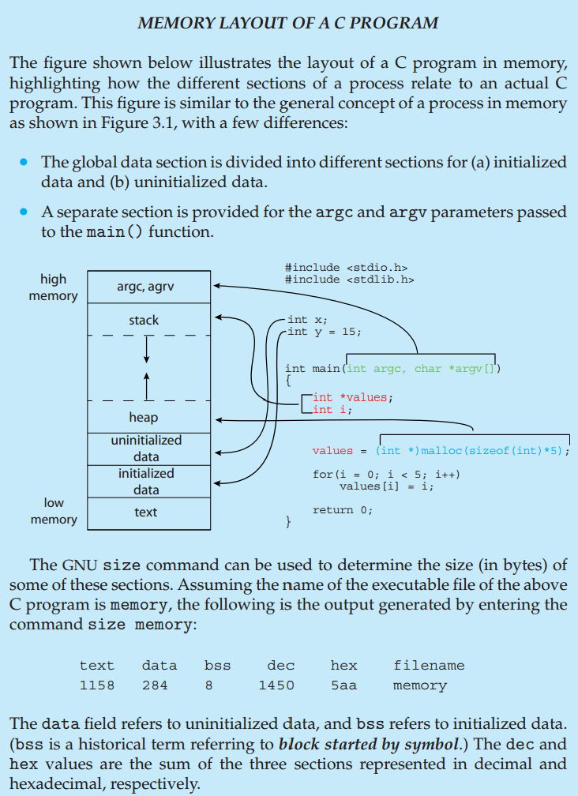

# 3. Processes
## **3.1 Process Concept**
- **Concept**: A process is an instance of a program in execution, which includes the program code, associated data, stack, counters, etc.

- **States of a process**: New, Ready, Running, Waiting, and Terminated.

## **3.2 Process Scheduling**
- **Purpose**: To maximize CPU utilization and program response time, the operating system must select the appropriate process to execute.
- **Types of Schedulers**: Short-term scheduler (CPU scheduler), long-term scheduler (job scheduler), and mid-term scheduler.

## **3.3 Operations on Processes**
- **Creation and Deletion**: Operating systems provide mechanisms for creating new processes and terminating existing ones.
- **Process Blocking and Waking**: Processes can be blocked by events and awakened when an event occurs.

## **3.4 Interprocess Communication (IPC)**
- **Methods**: Communication between processes can be achieved through shared memory or message passing (direct or indirect communication).
- **Pipes**: One of the IPC mechanisms provided by UNIX and Windows systems, allowing data to flow between processes.

## **3.5 IPC in Shared-Memory Systems**
- **Shared Memory Model**: Processes can access the same memory locations, with no operating system intervention in their data exchange.

## **3.6 IPC in Message-Passing Systems**
- **Message-Passing Model**: Processes exchange data by sending and receiving messages, suitable for communication between processes in distributed systems.

## **3.7 Examples of IPC Systems**
- **Client-Server Model**: A common application architecture where the client makes requests and the server responds to those requests.

## **3.8 Communication in Client-Server Systems**
- **Network Communication**: Uses sockets and Remote Procedure Calls (RPCs) to facilitate communication between programs on different hosts in a network.

## **3.9 Summary**
- **Summary**: This chapter introduces the concept of processes, scheduling, operations, and various ways and models of interprocess communication.

- **Understading Process and Thread**:　https://medium.com/erens-tech-book/%E7%90%86%E8%A7%A3-process-thread-94a40721b492

