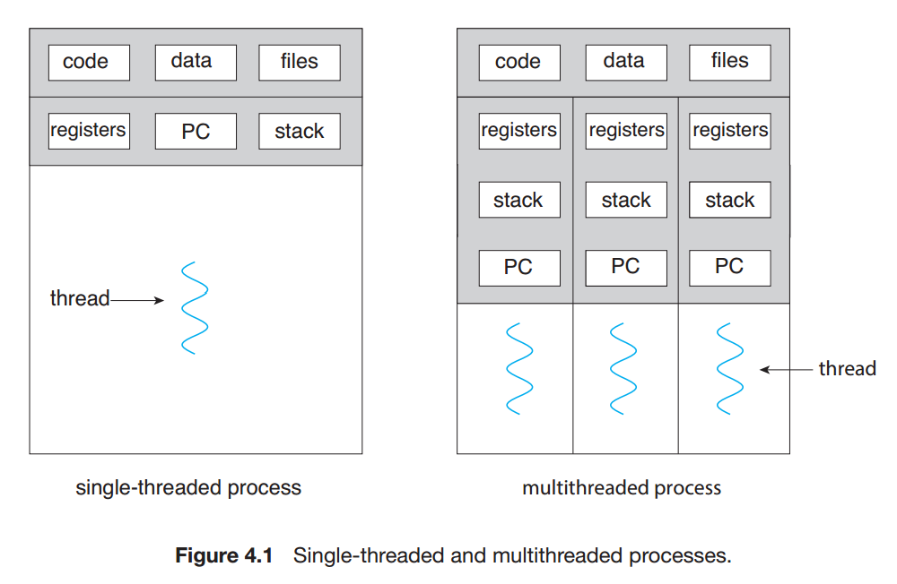
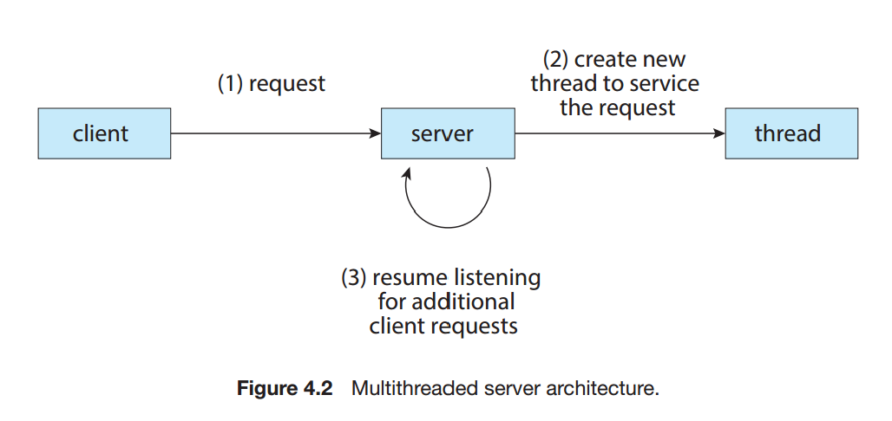

# 4. Threads
## **4.1 Overview**
- **Threads**: A thread is a basic unit of CPU utilization; it comprises a thread ID, a program counter, a register set, and a stack.
    
    

## **4.2 Multicore Programming**
- **Importance**: Addresses the utilization of multiple CPU cores for improving performance.
- **Challenges**: Discusses the complexities involved in concurrent execution and resource sharing across cores.

## **4.3 Multithreading Models**
- **Models Covered**: Reviews different models of system-level and user-level multithreading.

## **4.4 Thread Libraries**
- **Purpose**: Details the APIs and libraries available for thread management and synchronization.
- **Examples**: POSIX threads, Java threading mechanisms.

## **4.5 Implicit Threading**
- **Techniques**: Discusses the abstraction of thread management from the programmer to simplify concurrent programming.
- **Tools**: Describes language-level features and compiler strategies that help in implicit threading.

## **4.6 Threading Issues**
- **Concerns**: Identifies common issues like synchronization, data splitting, and resource allocation.
- **Solutions**: Provides best practices for avoiding or resolving these issues.

## **4.7 Operating-System Examples**
- **Case Studies**: Demonstrates how modern operating systems implement threading and handle concurrency.
- **Systems Discussed**: Examples from Linux, Windows, and macOS.

## **4.8 Summary**
- **Key Takeaways**: Summarizes the critical points about threads and concurrency discussed in the chapter.
